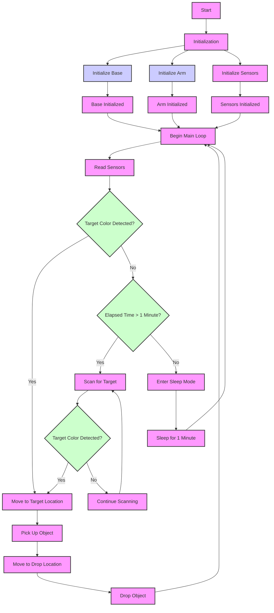

### Detailed Explanation

1. **Initialization (B)**
   - **Initialize Base (C)**: Sets up the motor driver and motors.
   - **Initialize Arm (D)**: Sets up the servos for the robot arm.
   - **Initialize Sensors (E)**: Sets up the color and ultrasonic sensors.

2. **Main Loop (I)**
   - **Read Sensors (J)**: Reads data from the color and ultrasonic sensors.
   - **Target Color Detected? (K)**: Checks if the detected color matches the target color (e.g., red).

3. **If Target Color Detected (K == Yes)**
   - **Move to Target Location (L)**: Moves the robot to the detected color location.
   - **Pick Up Object (S)**: Activates the arm to pick up the object.
   - **Move to Drop Location (T)**: Moves the robot arm to the designated drop location.
   - **Drop Object (U)**: Releases the object.
   - **Return to Main Loop (I)**

4. **If Target Color Not Detected (K == No)**
   - **Elapsed Time > 1 Minute? (M)**: Checks if 1 minute has passed since the last scan.

5. **If Time Elapsed (M == Yes)**
   - **Scan for Target (N)**: Moves the arm to scan for the target color.
   - **Target Color Detected? (Q)**: Checks if the target color is found during scanning.
     - **If Target Detected (Q == Yes)**: Moves to the target location and performs pick-and-drop actions (L, S, T, U).
     - **If Target Not Detected (Q == No)**: Continues scanning (R).

6. **If No Time Elapsed (M == No)**
   - **Enter Sleep Mode (O)**: Enters sleep mode if the time interval has not yet passed.
   - **Sleep for 1 Minute (P)**: Waits for 1 minute before rechecking the target.

This flow covers the initialization, continuous operation, and decision-making process of the robot arm system.
