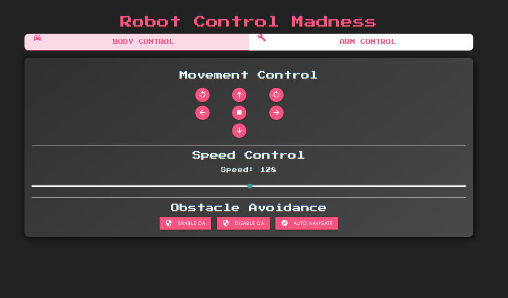
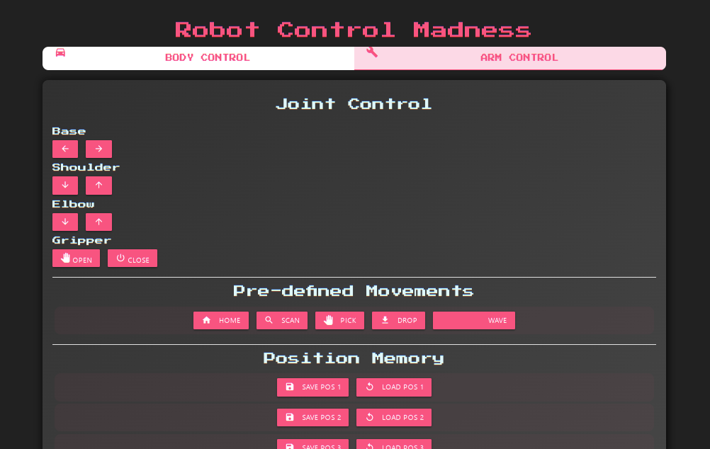
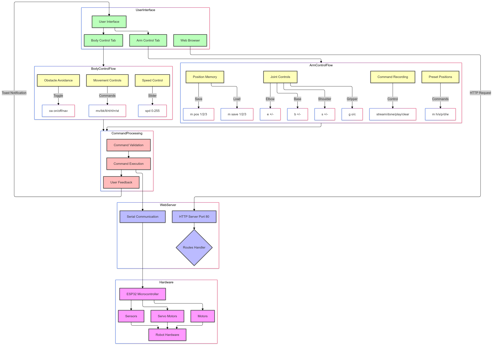

# Robot Control Web Interface

A web-based interface for controlling a robot with both body movement and robotic arm capabilities. This project uses an ESP32/8266 microcontroller to host a web server that provides a responsive, modern UI for robot control.

## Interface Preview

<div align="center">
  <div style="display: flex; justify-content: center; gap: 20px; margin-bottom: 20px;">
    
    
  </div>
  <p><em>Left: Body Control Interface - Right: Arm Control Interface</em></p>
</div>

## Features

### Body Control
- **Directional Movement**
  - Forward/Backward movement
  - Left/Right turns
  - Rotate left/right
  - Emergency stop
- **Speed Control**
  - Adjustable speed via slider (0-255)
- **Obstacle Avoidance**
  - Enable/Disable obstacle avoidance
  - Autonomous navigation mode

### Arm Control
- **Joint Control**
  - Base rotation (left/right)
  - Shoulder movement (up/down)
  - Elbow movement (up/down)
  - Gripper control (open/close)
- **Pre-defined Movements**
  - Home position
  - Scan position
  - Pick object
  - Drop object
  - Wave gesture
- **Position Memory**
  - Save up to 3 custom positions
  - Load saved positions
- **Command Recording**
  - Record movement sequences
  - Play recorded sequences
  - Clear recordings

### IP Address Indication
- **LED Blink Sequence**
  - The onboard LED will blink according to the last two segments of the IP address upon successful WiFi connection, repeating the sequence twice for clarity.

## Technical Specifications

### Hardware Requirements
- ESP32 microcontroller
- Robot chassis with motors
- Robotic arm with servos
- Power supply
- WiFi connection

### Software Dependencies
- Arduino IDE
- Libraries:
  - WiFi.h
  - WebServer.h
- Frontend Libraries (CDN):
  - Materialize CSS 1.0.0
  - Material Icons
  - Press Start 2P font

## Installation

1. Clone this repository:

2. Open `code.ino` in Arduino IDE

3. Update WiFi credentials:
```cpp
const char* ssid = "YOUR_WIFI_SSID";
const char* password = "YOUR_WIFI_PASSWORD";
```

4. Upload the code to your ESP32

## Usage

1. Power on your robot

2. Connect to the same WiFi network as the robot

3. Access the web interface:
   - Open a web browser
   - Navigate to the ESP32's IP address (printed to Serial Monitor)
   - Default port: 80

### LED IP Blink Sequence
Once connected to WiFi, the onboard LED will blink to indicate the last two segments of the IP address:
- Blinks the number of times corresponding to the third segment
- Short pause, then blinks for the fourth segment
- Repeats the sequence twice

This allows you to identify the robot's IP address for quick access.

### Control Commands

#### Body Movement
- `mv` - Move forward
- `bk` - Move backward
- `lt` - Turn left
- `rt` - Turn right
- `rl` - Rotate left
- `rr` - Rotate right
- `st` - Stop
- `spd X` - Set speed (X: 0-255)

#### Arm Movement
- `b +/-` - Base rotation
- `s +/-` - Shoulder movement
- `e +/-` - Elbow movement
- `g o/c` - Gripper open/close

#### Pre-defined Movements
- `m h` - Home position
- `m s` - Scan position
- `m p` - Pick object
- `m d` - Drop object
- `m w` - Wave

#### Position Memory
- `m pos X` - Save position (X: 1-3)
- `m save X` - Load position (X: 1-3)

#### Recording
- `stream` - Start recording
- `done` - Stop recording
- `play` - Play recording
- `clear` - Clear recording

## User Interface

The interface features a modern, retro-styled design with:
- Responsive layout
- Tab-based navigation
- Touch-friendly controls
- Visual feedback
- Dark theme
- Intuitive icons
- Status notifications

## Flowchart



## Customization

### Styling
The UI can be customized by modifying the CSS in `ui_index.h`:
- Color scheme
- Button styles
- Animations
- Layout
- Typography

### Adding New Commands
1. Add new button in the HTML section
2. Define command in the `sendCommand()` function
3. Implement command handling in the Arduino code

## Troubleshooting

### Common Issues
1. **Can't connect to WiFi**
   - Verify credentials
   - Check WiFi signal strength
   - Ensure ESP32 is powered properly

2. **Commands not responding**
   - Check serial monitor for errors
   - Verify IP address
   - Check network connectivity

3. **UI not loading**
   - Clear browser cache
   - Check browser console for errors
   - Verify all CDN resources are loading

## Contributing

1. Fork the repository
2. Create a feature branch
3. Commit changes
4. Push to the branch
5. Create a Pull Request

## License

This project is licensed under the MIT License - see the LICENSE file for details.

## Acknowledgments

- Materialize CSS team
- ESP32 community
- Google Fonts
- Material Icons

## Support

For support, please:
1. Check the issues section
2. Review troubleshooting guide
3. Create a new issue with:
   - Detailed description
   - Steps to reproduce
   - Expected behavior
   - Actual behavior
   - System information
