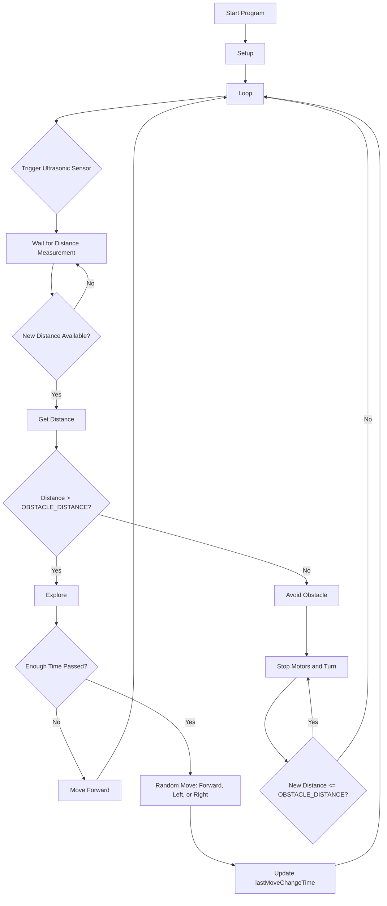

```mermaid
flowchart TD
    A[Start Program] --> B[Setup]
    B --> C[Loop]
    C --> D{Trigger Ultrasonic Sensor}
    D --> E[Wait for Distance Measurement]
    E --> F{New Distance Available?}
    F -->|No| E
    F -->|Yes| G[Get Distance]
    G --> H{Distance > OBSTACLE_DISTANCE?}
    H -->|Yes| I[Explore]
    H -->|No| J[Avoid Obstacle]
    I --> K{Enough Time Passed?}
    K -->|No| L[Move Forward]
    K -->|Yes| M[Random Move: Forward, Left, or Right]
    M --> N[Update lastMoveChangeTime]
    J --> O[Stop Motors and Turn]
    O --> P{New Distance <= OBSTACLE_DISTANCE?}
    P -->|Yes| O
    P -->|No| C
    N --> C
    L --> C
```
