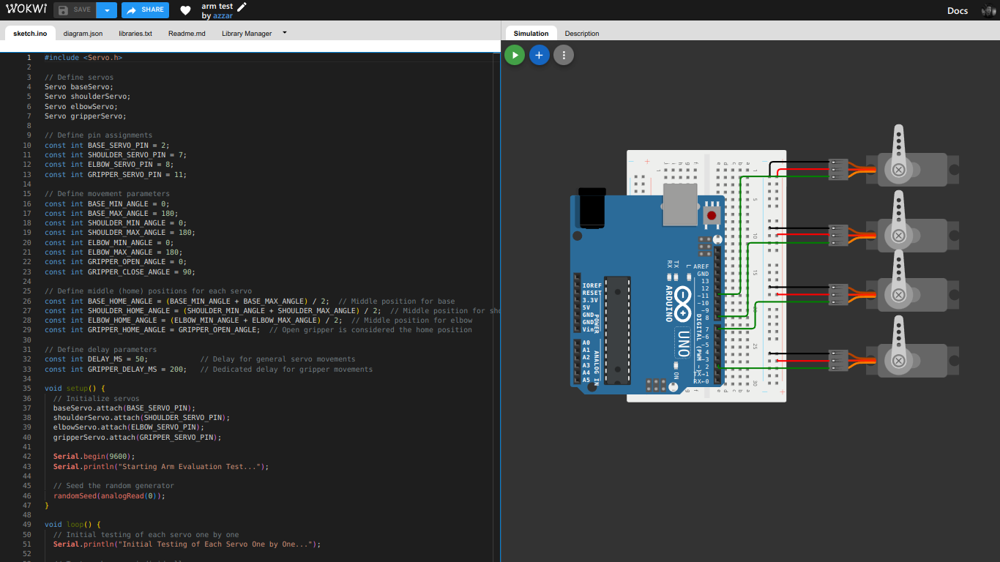
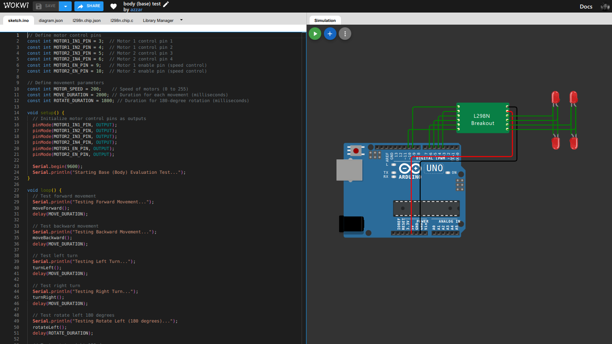
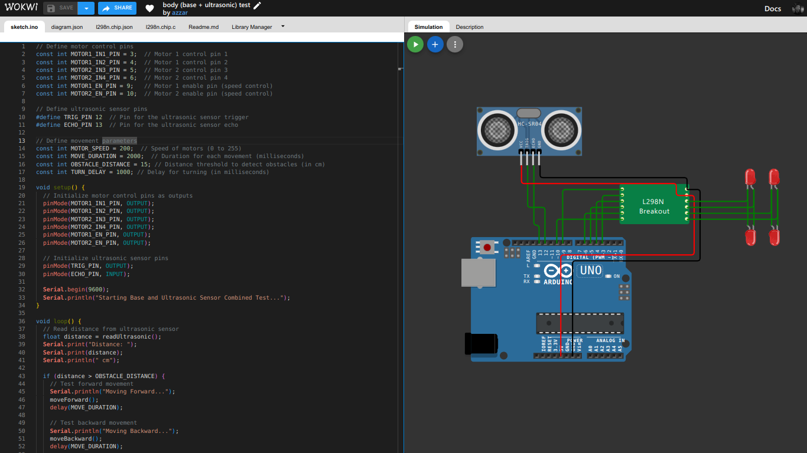
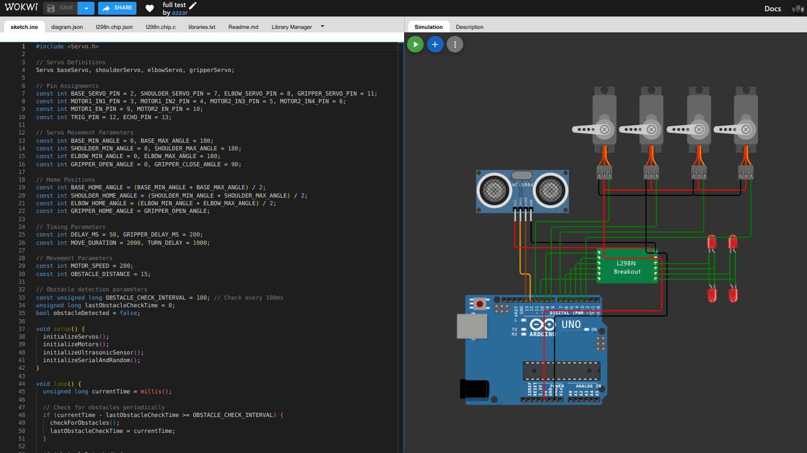
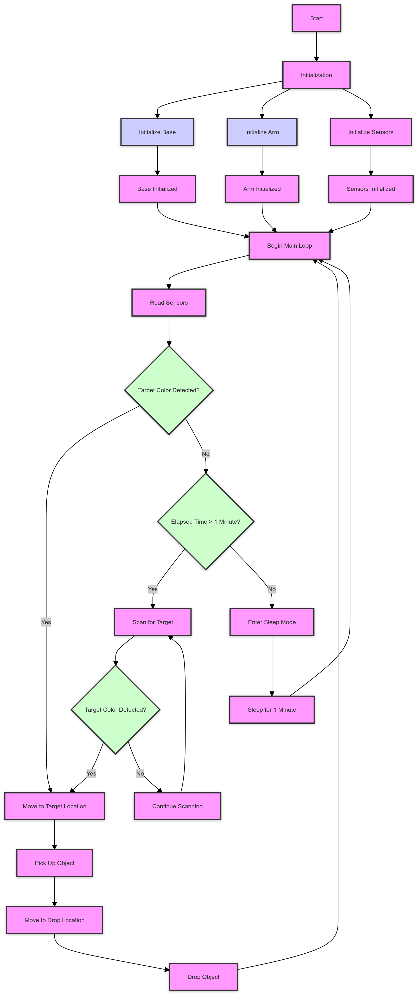

# Robot Arm with Color Sensor and Movement Control

This project involves building a simple robot arm with a mobile base using an Arduino. The robot arm is equipped with a color sensor (TCS34725) and an ultrasonic sensor (HC-SR04) for object detection and movement control. The arm is capable of picking up objects based on color detection, moving to specific locations, and performing scanning routines.

## Components

1. **Arduino Board**: Central controller.
2. **SG90 Servos**: 4 servos for controlling the robot arm's degrees of freedom (DOF) and gripper.
3. **DC Motors**: 2 or 4 motors for driving the robot base.
4. **L298N Motor Driver**: Motor driver for controlling the DC motors.
5. **TCS34725 Color Sensor**: Color sensor to detect the target color (red).
6. **HC-SR04 Ultrasonic Sensor**: Ultrasonic sensor for distance measurement.

## Pinout

### Arduino to L298N Motor Driver
| Arduino Pin | L298N Pin | Description     |
|-------------|-----------|-----------------|
| 3           | IN1       | Motor 1 Control |
| 4           | IN2       | Motor 1 Control |
| 5           | IN3       | Motor 2 Control |
| 6           | IN4       | Motor 2 Control |
| 9           | ENA       | Motor 1 Speed   |
| 10          | ENB       | Motor 2 Speed   |

### Arduino to Servos
| Servo     | Arduino Pin | Description      |
|-----------|-------------|------------------|
| Base      | 13           | Base Servo       |
| Shoulder  | 7           | Shoulder Servo   |
| Elbow     | 8           | Elbow Servo      |
| Gripper   | 11          | Gripper Servo    |

### Arduino to TCS34725 Color Sensor
| Sensor Pin | Arduino Pin | Description     |
|------------|-------------|-----------------|
| SDA        | A4          | I2C Data Line   |
| SCL        | A5          | I2C Clock Line  |
| VCC        | 5V          | Power Supply    |
| GND        | GND         | Ground          |

### Arduino to HC-SR04 Ultrasonic Sensor
| Sensor Pin | Arduino Pin | Description     |
|------------|-------------|-----------------|
| Trig       | 12          | Trigger Pin     |
| Echo       | 2           | Echo Pin        |
| VCC        | 5V          | Power Supply    |
| GND        | GND         | Ground          |

## Code Overview

The project is organized into four main components:

- *BaseControl* : Handles movement of the robot base (forward, backward, turn left, turn right).
- *ArmControl* : Controls the robot arm's movements (pick up, drop, move to object, scan).
- *SensorControl* : Interfaces with the color and ultrasonic sensors.
- *Main.ino* : Coordinates the overall functionality, including scanning, movement, and object handling.

### BaseControl

Controls the movement of the robot's base using the DC motors. Includes functions to move forward, backward, turn left, and turn right.

### ArmControl

Manages the robot arm's servos to pick up and drop objects, move to specific locations, and perform scanning routines.

### SensorControl

Reads data from the color sensor and ultrasonic sensor to detect the target color and measure distances.

### Main.ino

Combines the functionality of the base control, arm control, and sensor control. Implements the scanning and sleep routines.

## Usage

1. **Setup**: Connect all components according to the pinout tables.
2. **Upload**: Upload the code to the Arduino using the Arduino IDE.
3. **Operation**: The robot arm will start scanning for the target color. When the target is detected, it will move to the object, pick it up, and perform a drop action. If no target is detected, it will enter sleep mode and resume scanning after 1 minute.

    **also here was the test code to test the components per major part** :

    located at test code folder.
    - `test_arm.ino` : to test the robot Arm movement
    - `test_motor.ino` : to test the base/body of the robot
    - `test_body.ino` : to test the base + ultrasonic
    - `test_sensors.ino` : to test the TCS34725 color sensor and the HC-SR04
    - `test_full.ino` : to test the base + arm + ultrasonic
    ultrasonic distance sensor

    here some simulation for it:
    - [test arm](https://wokwi.com/projects/408620451728441345)
        - 
    - [test body](https://wokwi.com/projects/408652834209415169)
        - 
    - [test body + ultrasonic](https://wokwi.com/projects/408655480325044225)
        - 
    - [test body + arm](https://wokwi.com/projects/408848638325889025)
        - 

## Wiring Diagram

For a visual representation of the wiring, refer to the schematic diagram provided in the project's repository or create your own based on the pinout tables.

## Flowchart

- 

## License

This project is licensed under the MIT License. See the [LICENSE](LICENSE) file for details.

## Acknowledgments

- The SG90 servo motors, L298N motor driver, TCS34725 color sensor, and HC-SR04 ultrasonic sensor are commercially available components used in this project.
