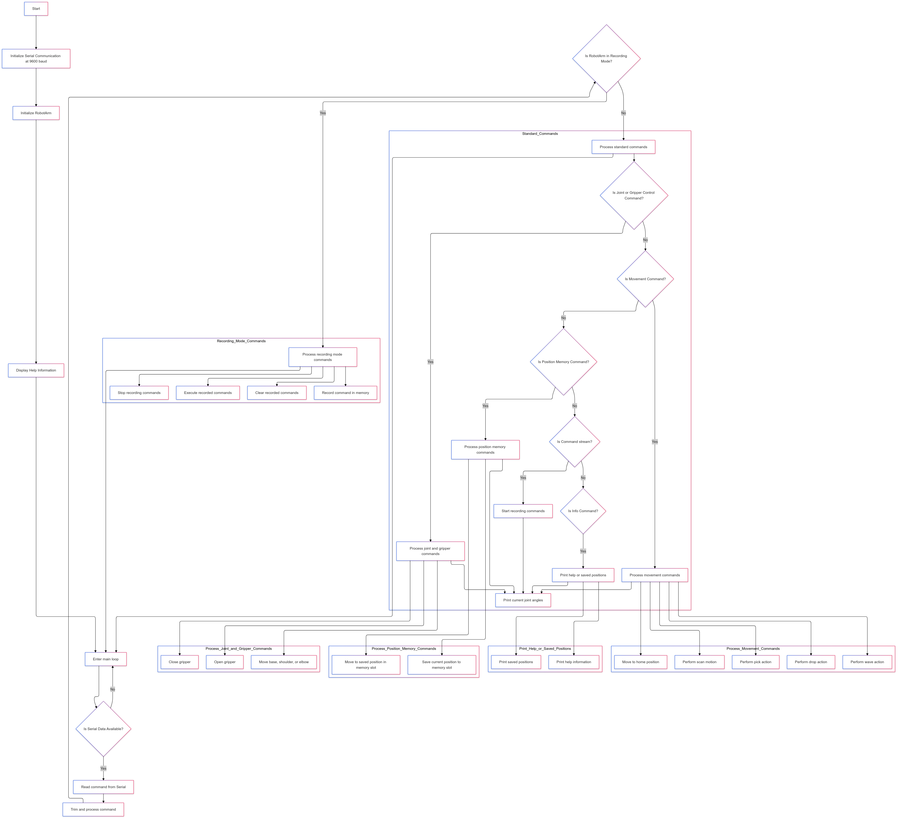

# Robotic Arm Serial Controller

This project provides a software interface for controlling a robotic arm using an Arduino. The code enables movement of different joints (base, shoulder, elbow, and gripper) and offers functionalities such as position memory, pre-defined movements, and command recording/playback.

## Features

- **Direct Joint Control**: Independently control each joint of the arm (base, shoulder, elbow, gripper) with specific commands.
- **Pre-defined Movements**: Execute complex actions like scanning, picking, dropping, and waving.
- **Position Memory**: Save specific positions to memory and retrieve them later.
- **Command Recording**: Record sequences of commands for playback, allowing automated movement routines.
- **Help and Info Commands**: Display available commands and saved positions.

## Hardware Requirements

- **Microcontroller**: Arduino (compatible with `RobotArm` library)
- **Robot Arm**: A 4-joint robotic arm (Base, Shoulder, Elbow, Gripper)
- **Connections**: Pins assigned as per the following:

  | Component  | Pin  |
  |------------|------|
  | Base       | 13   |
  | Shoulder   | 7    |
  | Elbow      | 8    |
  | Gripper    | 11   |

## Software Requirements

- **Arduino IDE**: Version 1.8.13 or later
- **RobotArm Library**: Custom library that manages individual joint and movement commands

## Installation

1. Clone this repository to your local machine.
2. Place `RobotArm.h` and `RobotArm.cpp` files in the same directory as `main.ino` or install the library if packaged.
3. Open `main.ino` in Arduino IDE.
4. Connect your Arduino and upload the code.

## Code Overview

- `main.ino`: Main Arduino sketch that sets up serial communication and handles commands.
- `RobotArm.h` and `RobotArm.cpp`: Custom library files that control the robotic arm’s movements.

### Code Flow

1. **Setup Phase**: Initializes serial communication and sets up the robotic arm.
2. **Loop Phase**: Waits for commands from the serial monitor to control joints, execute saved movements, or manage position memory and recordings.

## Commands

Commands can be sent over the serial monitor to control the arm. All commands are case-sensitive and should be followed by parameters when necessary.

### 1. Joint Control

| Command | Description               |
|---------|---------------------------|
| `b +/-` | Move base left/right      |
| `s +/-` | Move shoulder up/down     |
| `e +/-` | Move elbow up/down        |
| `g o/c` | Open/close gripper        |

### 2. Pre-defined Movements

| Command | Description                   |
|---------|-------------------------------|
| `m h`   | Move to the home position     |
| `m s`   | Execute a scanning movement   |
| `m p`   | Pick an object                |
| `m d`   | Drop an object                |
| `m w`   | Wave the arm                  |

### 3. Position Memory

| Command         | Description                       |
|-----------------|-----------------------------------|
| `m pos ##`      | Save current position (1-3)      |
| `m save ##`     | Move to saved position (1-3)     |

### 4. Command Recording

| Command   | Description                       |
|-----------|-----------------------------------|
| `stream`  | Start recording commands          |
| `done`    | Stop recording                    |
| `play`    | Play back recorded commands       |
| `clear`   | Clear all recorded commands       |

### 5. Information Commands

| Command | Description                      |
|---------|----------------------------------|
| `p h`   | Print help information           |
| `p s`   | Print all saved positions        |

## Usage

1. **Open Serial Monitor**: Set baud rate to 9600 in the Arduino Serial Monitor.
2. **Enter Commands**: Use the commands above to control each joint or execute actions.
3. **Position Memory and Recording**: Use position memory and recording commands to automate tasks.

### Example Commands

- **Move the base left**: `b -`
- **Open the gripper**: `g o`
- **Move to home position**: `m h`
- **Save current position as 1**: `m pos 1`
- **Execute saved position 1**: `m save 1`
- **Start recording commands**: `stream`
- **Stop recording**: `done`
- **Play recorded commands**: `play`

## Dependencies

Ensure that `RobotArm.h` and `RobotArm.cpp` are included in the project or installed as a library.

## Troubleshooting

- **Command Not Recognized**: Ensure that the command syntax matches the descriptions.
- **Movement Out of Bounds**: Avoid exceeding the physical limits of your robotic arm to prevent damage.
- **Serial Communication**: Make sure the Serial Monitor is set to a baud rate of 9600.

## Simulation

You can try the code on this [wokwi simulation](https://wokwi.com/projects/412701713440647169)

## flowchart

