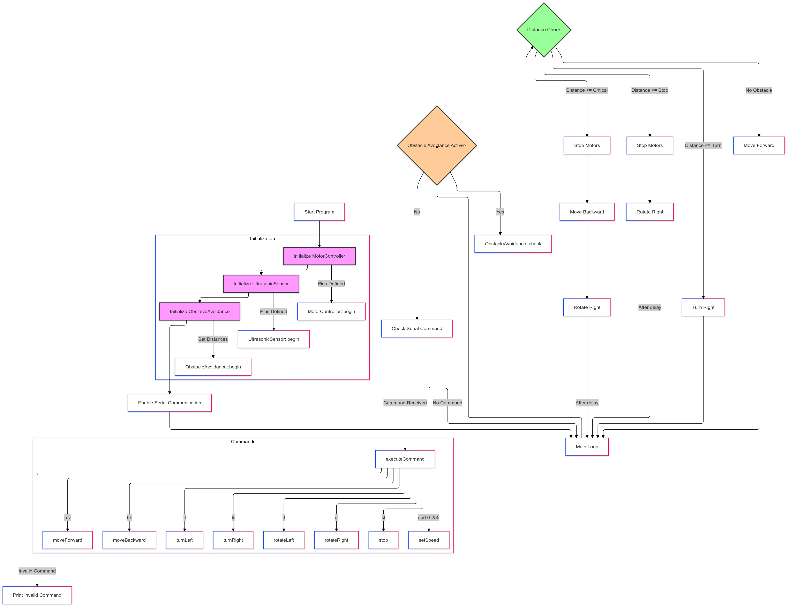

# Ultrasonic Obstacle Avoidance and Movement Control

This project controls a robot with obstacle avoidance and movement capabilities using Arduino. It leverages motor controllers for movement, an ultrasonic sensor for obstacle detection, and serial commands for interactive control.

### Overview

This project integrates movement control with obstacle avoidance to create an interactive and autonomous robotic system. The core functionalities are controlled through a series of serial commands, enabling manual movement, speed control, obstacle detection, and autonomous navigation.

### Hardware Requirements

- **Arduino (Uno, Mega, etc.)**
- **Motor Driver**: Compatible with two DC motors (e.g., L298N or similar).
- **Ultrasonic Sensor**: HC-SR04 or equivalent for distance measurement.
- **Wiring Components**: Jumper wires, breadboard (if necessary).
- **Power Supply**: As required for your specific motors and Arduino setup.

### Software Requirements

- **Arduino IDE**: Version 1.8 or later.
- **MotorController Library** (user-defined in code)
- **UltrasonicSensor Library** (user-defined in code)
- **ObstacleAvoidance Library** (user-defined in code)

### Pin Configuration

| Component       | Pin(s) | Description                   |
|-----------------|--------|-------------------------------|
| Motor 1 IN1     | 3      | Motor 1 control pin 1         |
| Motor 1 IN2     | 4      | Motor 1 control pin 2         |
| Motor 2 IN1     | 5      | Motor 2 control pin 1         |
| Motor 2 IN2     | 6      | Motor 2 control pin 2         |
| Motor 1 ENA     | 9      | Motor 1 speed control         |
| Motor 2 ENB     | 10     | Motor 2 speed control         |
| Ultrasonic TRIG | 12     | Trigger pin for distance      |
| Ultrasonic ECHO | 2      | Echo pin for distance         |

### Command List

Below are the commands you can send over serial to control the robot's various functions.

#### Movement Commands
- **`mv`**: Move forward
- **`bk`**: Move backward
- **`lt`**: Turn left
- **`rt`**: Turn right
- **`rl`**: Rotate left (in place)
- **`rr`**: Rotate right (in place)
- **`st`**: Stop all motor movement

#### Speed Control
- **`spd <0-255>`**: Set motor speed to a specified value (0-255)

#### Obstacle Avoidance
- **`oa on`**: Enable obstacle avoidance mode
- **`oa off`**: Disable obstacle avoidance mode
- **`oa nav`**: Start autonomous navigation with obstacle avoidance

#### Sensor Readout
- **`dist`**: Get the current distance reading from the ultrasonic sensor
- **`help`**: Show all available commands

### Installation

1. **Clone or download the project files**.
2. **Install the required libraries**: Include `MotorController`, `UltrasonicSensor`, and `ObstacleAvoidance` libraries in your Arduino library folder.
3. **Open the `.ino` file in the Arduino IDE**.
4. **Upload the code** to your Arduino after setting the correct board and COM port.

### Usage

1. **Power up your setup** and open the Serial Monitor in the Arduino IDE (9600 baud rate).
2. **Send commands** listed in the Command List to control the robot:
   - Use movement commands to drive or rotate the robot manually.
   - Set speed with `spd <value>`, where `<value>` is between 0 and 255.
   - Enable obstacle avoidance with `oa on` to allow the robot to autonomously avoid obstacles.
3. **Autonomous Navigation**: Use the command `oa nav` to start obstacle-aware navigation. Send `st` during navigation to stop.

### Troubleshooting

- **Command not recognized**: Ensure commands are typed as specified (e.g., lowercase for commands).
- **No response from ultrasonic sensor**: Check TRIG and ECHO pin connections.
- **Motor does not respond**: Verify motor driver connections, power supply, and ensure the motor driver supports PWM.

## Simulation

You can try the code on this [wokwi simulation](https://wokwi.com/projects/411701535913761793)

## flowchart

